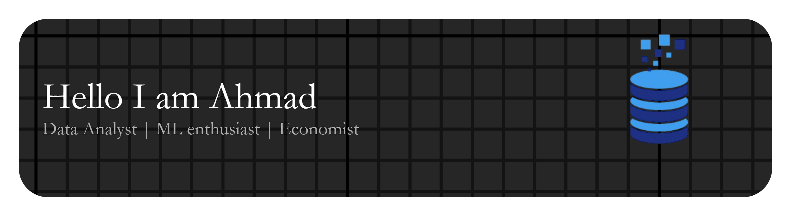

**I bridge the gap between complex data and strategic decision-making. With a background blending economic principles and modern data analytics, I specialize in transforming raw data into interactive dashboards and actionable business intelligence.**
assss

### 🛠️ Skillsets & Tools
* **Languages:** 

* **Visualization:** 

Looker Studio, Power BI, Microsoft Excel
* **Domain skills:** Econometric Modeling, Statistical Analysis, Root-Cause Analysis, PDCA

---

### 📫 Connect with Me
* 💼 [LinkedIn]([your-linkedin-link](https://www.linkedin.com/in/ahmad-rudyan-ibrahim))
* 📧 [Email](rudyanibrahim@gmail.com)
* 📞 [Whatsapp](https://wa.me/6285335274219)

